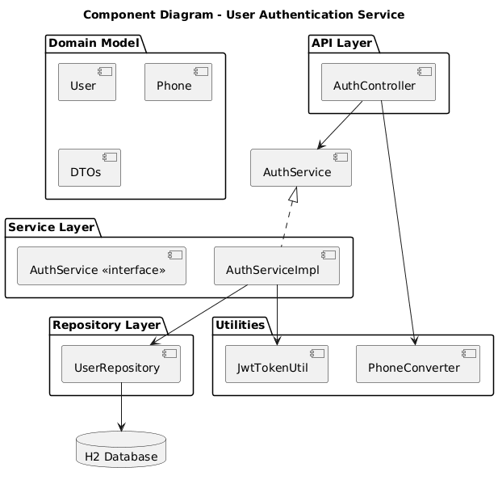
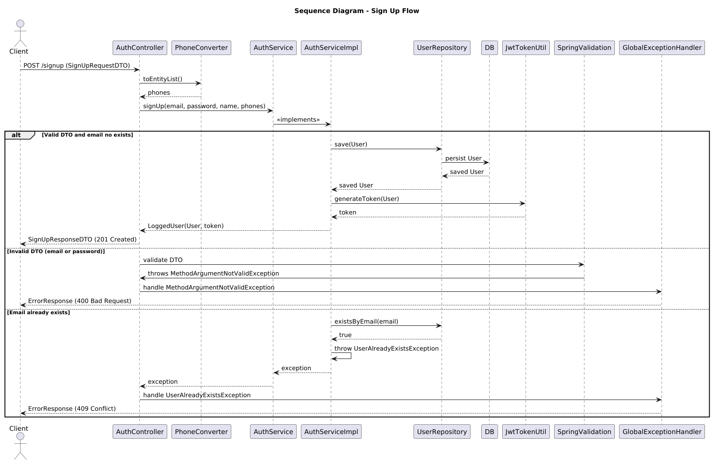
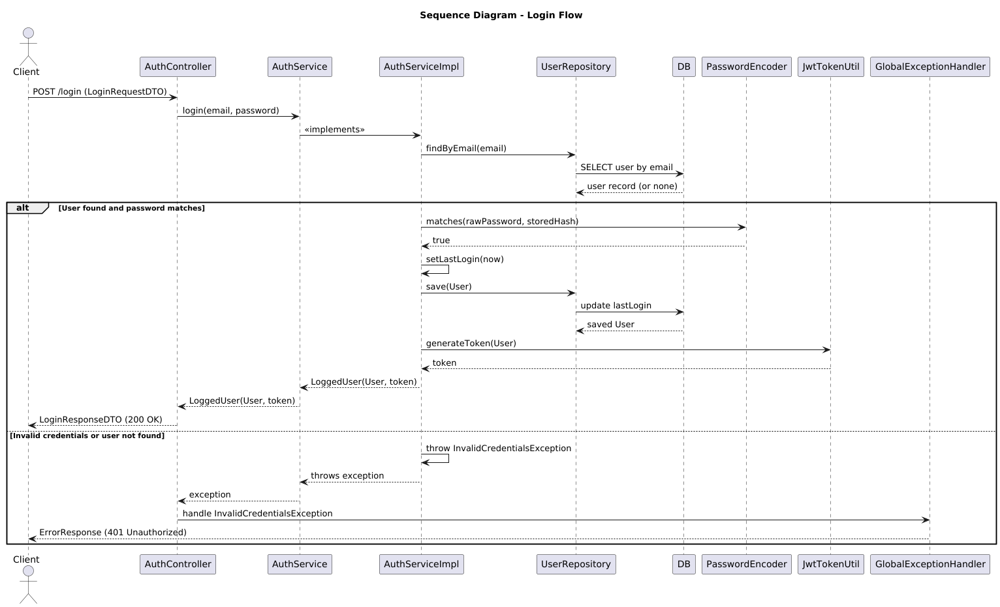

# User Authentication Service

A microservice built with **Spring Boot 2.5.14** and **Gradle 7.4**,
providing user registration and login with JWT-based authentication.
Data is stored in an in-memory H2 database.

------------------------------------------------------------------------

## 🚀 Technologies Used

-   **Java 11**
-   **Spring Boot 2.5.14**
-   **Spring Web**
-   **Spring Data JPA**
-   **H2 Database**
-   **Spring Security Crypto (BCrypt)**
-   **JWT (jjwt)**
-   **Gradle 7.4**
-   **JUnit 5** + **JaCoCo** (80%+ service layer coverage)

------------------------------------------------------------------------

## 🛠️ Build and Run Instructions

### Prerequisites

-   JDK 11 installed (`java -version`)
-   Gradle wrapper included in the project (no need to install Gradle
    globally)

### Build

``` bash
./gradlew clean build
```

### Run (dev mode)

``` bash
./gradlew bootRun
```

Application will start at:
👉 <http://localhost:8080>

------------------------------------------------------------------------

## 📐 Design Decisions

-   **Phone numbers as `String`**
    The original statement suggested `long` for phone numbers and `int`
    for city codes.
    This was replaced with `String` because phone numbers:
    -   Can contain leading zeros (lost if stored as numeric).
    -   May include symbols such as `+`, `-`, or extensions.
    -   Are identifiers, not values for calculations.
-   **Entity Mapping**
    -   UUID (`uuid2` strategy) is used as the primary key.
    -   Passwords are stored securely using **BCrypt**.

------------------------------------------------------------------------

## 📊 UML Diagrams

### Component Diagram [(PlantUML File)](docs/diagrams/component_diagram.puml)

 

### Sequence Diagram - Sign Up [(PlantUML File)](docs/diagrams/signup_sequence_diagram.puml)



### Sequence Diagram - Login [(PlantUML File)](docs/diagrams/login_sequence_diagram.puml)



------------------------------------------------------------------------

## ✨ Possible Improvements

1.  **Do not log in on sign-up**

    Currently, the sign-up endpoint issues a JWT as per the assignment.
    In a real-world scenario, registration and authentication should be
    separated.

2.  **Generate a dedicated JWT for email verification**

    Instead of returning a login token at sign-up, return a **special
    JWT with longer expiration** to validate the user's email.

3.  **Create a new endpoint for email validation**

    -   Endpoint could receive the verification JWT.
    -   If valid, the user's account is marked as active.

4.  **Activate user only after email validation**

    -   At sign-up: create the user with `isActive = false`.
    -   After validation: set `isActive = true`.

------------------------------------------------------------------------

👉 With these improvements, the service would be closer to a
production-grade design, separating registration from authentication and
enhancing security.
