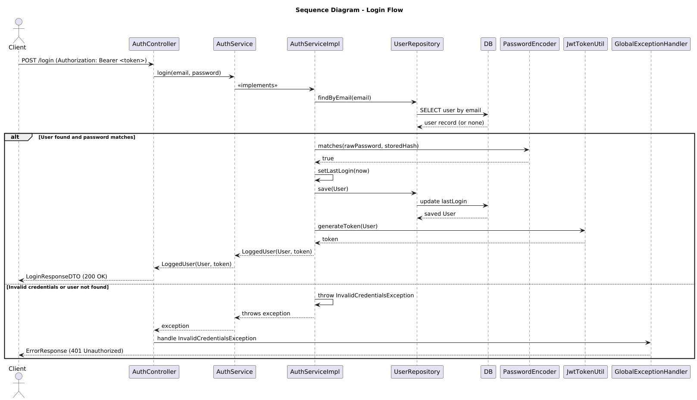

# User Authentication Service

A microservice built with **Spring Boot 2.5.14** and **Gradle 7.4**,
providing user registration and login with JWT-based authentication.
Data is stored in an in-memory H2 database.

------------------------------------------------------------------------

## 🚀 Technologies Used

-   **Java 11**
-   **Spring Boot 2.5.14**
-   **Spring Web**
-   **Spring Data JPA**
-   **H2 Database**
-   **Spring Security Crypto (BCrypt)**
-   **JWT (jjwt)**
-   **Gradle 7.4**
-   **JUnit 5** + **JaCoCo** (80%+ coverage)

------------------------------------------------------------------------

## 🛠️ Build and Run Instructions

### Prerequisites

-   JDK 11 installed (`java -version`)
-   Gradle wrapper included in the project (no need to install Gradle
    globally)

### Build

``` bash
./gradlew clean build
```

### Run (dev mode)

``` bash
./gradlew bootRun
```

Application will start at:
👉 <http://localhost:8080>

------------------------------------------------------------------------

## 📊 Generating and Viewing Test Coverage with JaCoCo

### Generating the Coverage Report

JaCoCo is configured in the project to generate a code coverage report. To generate the report, run the following command:

```bash
./gradlew clean test jacocoTestReport
```

This will generate the report files in the build/reports/jacoco/test directory.  

### Viewing the Coverage Report
1. Navigate to the directory where the report was generated:  

```bash
cd /build/jacocoHtml
```
2. Open the index.html file in your browser to view the report.

- On Linux:
```bash
xdg-open index.html
```

- On macOS:
```bash
open index.html
```

- On Windows:
```bash
start index.html
```

------------------------------------------------------------------------

## 📐 Design Decisions

-   **Phone numbers as `String`**
    The original statement suggested `long` for phone numbers and `int`
    for city codes.
    This was replaced with `String` because phone numbers:
    -   Can contain leading zeros (lost if stored as numeric).
    -   May include symbols such as `+`, `-`, or extensions.
    -   Are identifiers, not values for calculations.
-   **Entity Mapping**
    -   UUID (`uuid2` strategy) is used as the primary key.
    -   Passwords are stored securely using **BCrypt**.

------------------------------------------------------------------------

## 📊 UML Diagrams

### Component Diagram [(PlantUML File)](docs/diagrams/component_diagram.puml)

 

### Sequence Diagram - Sign Up [(PlantUML File)](docs/diagrams/signup_sequence_diagram.puml)


### Sequence Diagram - Login [(PlantUML File)](docs/diagrams/login_sequence_diagram.puml)


